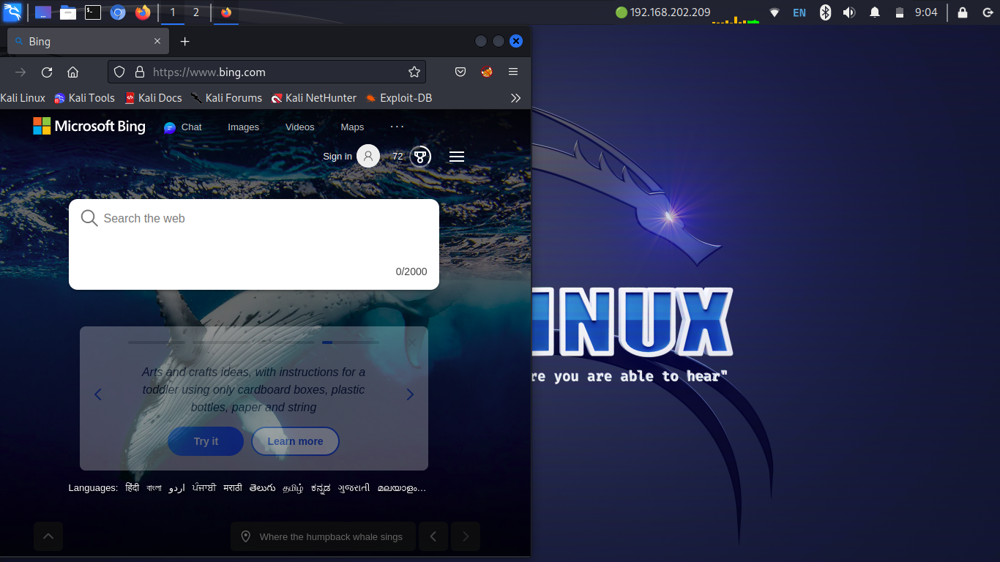

# my-kali-panel

# Panel Profiles Configuration Files

Welcome to the repository containing my panel profiles configuration files! In this repository, I am sharing the configuration files that I use for various panels. These profiles are designed to enhance the productivity and efficiency of different panels by customizing their settings according to my preferences.

## Table of Contents

- [About Panel Profiles](#about-panel-profiles)
- [Getting Started](#getting-started)
- [Usage](#usage)
- [Contributing](#contributing)

## About Panel Profiles

Panel profiles are pre-configured settings files that allow you to quickly switch between different configurations for panels. They typically include settings related to appearance, layout, shortcuts, extensions, and other customization options. By using panel profiles, you can streamline your workflow and have different configurations tailored to specific tasks or projects.

In this repository, you will find configuration files for various panels, such as:

- [Panel 1](./panel1.md): Configuration file for Panel 1.
- [Panel 2](./panel2.md): Configuration file for Panel 2.
- [Panel 3](./panel3.md): Configuration file for Panel 3.

Feel free to explore and download the configuration files that interest you.

## Getting Started

To use these panel profiles, you will need to have the respective panels installed on your system. Make sure you have the latest versions of the panels to ensure compatibility with the provided configuration files.

To get started, follow these steps:

1. Clone this repository to your local machine or download the desired configuration files directly.
2. Open the corresponding panel and locate the settings or configuration options.
3. Import the downloaded configuration file into the panel's settings.
4. Save the changes and restart the panel if required.
5. Enjoy the customized panel experience!

## Usage

Once you have imported the configuration files into the respective panels, you can start using them immediately. Experiment with different profiles to find the one that suits your preferences and needs the best.

If you want to create your own panel profiles based on the provided configurations, feel free to modify the settings according to your requirements and save them as new profiles.

Remember to back up your existing panel configurations before importing new profiles to ensure you can revert back if needed.

## Contributing

Contributions to this repository are welcome! If you have your own panel profiles or improvements to the existing ones, feel free to submit a pull request. Please make sure to include a detailed description of the changes and the panel for which the configuration is intended.

If you encounter any issues or have suggestions for new panel profiles, please open an issue, and I'll do my best to address them.
